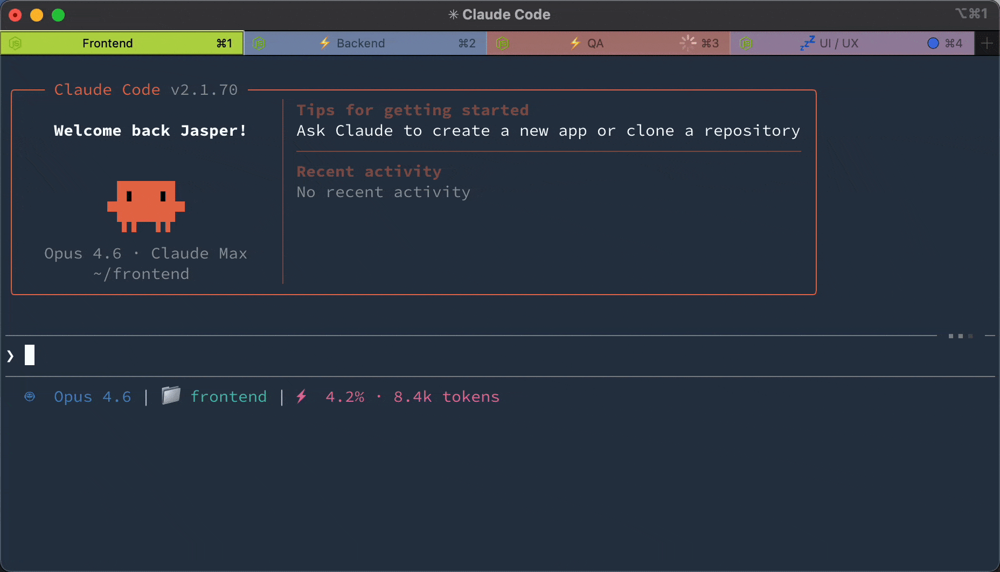
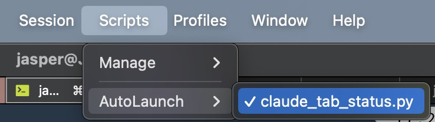

# Claude Code iTerm2 Tab Status

[](https://github.com/JasperSui/claude-code-iterm2-tab-status/actions/workflows/ci.yml)
[](https://opensource.org/licenses/MIT)

**See what every Claude Code session is doing.** Each iTerm2 tab shows a status prefix. ⚡ running, 💤 idle, or 🔴 needs attention (with flashing).



## Installation

### Claude Code (via Plugin Marketplace)

In Claude Code, register the marketplace first:

```bash
/plugin marketplace add JasperSui/jaspersui-marketplace
```

Then install the plugin from this marketplace:

```bash
/plugin install iterm2-tab-status@jaspersui-marketplace
```

On first session start, the plugin automatically:
1. Creates an iTerm2 Python runtime (if not already installed)
2. Deploys the tab-status adapter and COS overlay scripts to iTerm2 AutoLaunch
3. Deploys COS readback and safe-dispatch scripts to the iTerm2 Scripts menu

After the first session, **restart iTerm2** (or toggle **Scripts** → **AutoLaunch** for `claude_tab_status.py` and `cos_iterm_overlay.py`).




### Manual Setup

If auto-bootstrap didn't work, run:

```
/iterm2-tab-status:setup
```

### Uninstall

Run in Claude Code:
```
/iterm2-tab-status:uninstall
```

Then remove the plugin:
```bash
claude plugin uninstall iterm2-tab-status
```

## Three states

| State                              | Prefix | Tab Color      | Badge | Dismiss on Focus |
| ---------------------------------- | ------ | -------------- | ----- | ---------------- |
| **Running** — Claude is processing | ⚡      | No change      | No    | No               |
| **Idle** — Claude finished         | 💤      | No change      | No    | No               |
| **Attention** — needs permission   | 🔴      | Flashes orange | Yes   | Yes              |

Lifecycle: `User submits → ⚡ → Claude finishes → 💤 → User submits → ⚡ → Claude needs permission → 🔴 flash! → User focuses → cleared`

Your original tab color, title, and badge are saved and restored.

## How it works

```
Claude Code hooks → JSON signal file → iTerm2 adapter → tab status
```

No screen scraping. Claude Code's official [hooks API](https://docs.anthropic.com/en/docs/claude-code/hooks) writes a signal file on every event. The unified hook handles both `UserPromptSubmit` (→ running) and `Notification` (→ idle/attention). The iTerm2 adapter polls for signal files and sets the matching tab's prefix, color, and badge by TTY. Only the attention state flashes and shows a badge — running and idle are informational prefixes that persist.

## Configuration

The easiest way to configure is with the slash command in Claude Code:

```
/iterm2-tab-status:config
```

This opens an interactive prompt to change flash color, prefixes, badge, notifications, and more.

### Config file

Settings are stored in `~/.config/claude-tab-status/config.json`. Example with all keys and their defaults:

```json
{
  "dir": "~/.cache/claude-tab-status",
  "color_r": 255,
  "color_g": 140,
  "color_b": 0,
  "interval": 0.6,
  "prefix_running": "⚡ ",
  "prefix_idle": "💤 ",
  "prefix_attention": "🔴 ",
  "display_target": "title",
  "subtitle_activity_source": "off",
  "badge": "⚠️ Needs input",
  "badge_enabled": true,
  "notify": false,
  "sound": ""
}
```

The config file is **hot-reloaded** — changes take effect within ~1 second, no restart needed.

### Priority order

Settings are resolved in this order (highest wins):

1. **Environment variable** (e.g. `export CLAUDE_ITERM2_TAB_STATUS_COLOR_R=255`)
2. **Config file** (`~/.config/claude-tab-status/config.json`)
3. **Built-in defaults**

Environment variables are useful for CI or per-machine overrides without touching the config file.

### Display target

By default, status is shown as a tab title prefix.

Set `"display_target": "subtitle"` to leave the main tab title alone and write status to the iTerm2 user variable `user.claudeStatus`. In iTerm2, open **Settings > Profiles > General** and set **Subtitle** to:

```text
\(user.claudeStatus)
```

Use `"display_target": "both"` to update both the title prefix and subtitle variable.

Set `"subtitle_activity_source": "prompt"` to append a compact, sanitized activity snippet
to the subtitle, such as `⚡ Run tests`. The default is `"off"`, which keeps subtitle
output status-only and does not persist prompt text in signal files. Prompt snippets are
opt-in because Claude Code's `UserPromptSubmit` hook payload includes the submitted
prompt.

Claude Code can also set terminal titles. If you want iTerm2 to control the main title while this plugin updates the subtitle, add this to your shell startup file:

```bash
export CLAUDE_CODE_DISABLE_TERMINAL_TITLE=1
```

<details>
<summary>Environment variable reference</summary>

| Variable                                    | Default                  | Description                                     |
| ------------------------------------------- | ------------------------ | ----------------------------------------------- |
| `CLAUDE_ITERM2_TAB_STATUS_DIR`              | `$XDG_RUNTIME_DIR/claude-tab-status` or `~/.cache/claude-tab-status` | Signal file directory (per-user, mode 0700)     |
| `CLAUDE_ITERM2_TAB_STATUS_COLOR_R`          | `255`                    | Flash color red (0-255)                         |
| `CLAUDE_ITERM2_TAB_STATUS_COLOR_G`          | `140`                    | Flash color green (0-255)                       |
| `CLAUDE_ITERM2_TAB_STATUS_COLOR_B`          | `0`                      | Flash color blue (0-255)                        |
| `CLAUDE_ITERM2_TAB_STATUS_INTERVAL`         | `0.6`                    | Flash interval in seconds                       |
| `CLAUDE_ITERM2_TAB_STATUS_PREFIX_RUNNING`   | `⚡ `                     | Running state prefix                            |
| `CLAUDE_ITERM2_TAB_STATUS_PREFIX_IDLE`      | `💤 `                     | Idle state prefix                               |
| `CLAUDE_ITERM2_TAB_STATUS_PREFIX_ATTENTION` | `🔴 `                     | Attention state prefix                          |
| `CLAUDE_ITERM2_TAB_STATUS_DISPLAY_TARGET`   | `title`                  | Where to show status: `title`, `subtitle`, or `both` |
| `CLAUDE_ITERM2_TAB_STATUS_SUBTITLE_ACTIVITY_SOURCE` | `off`             | Subtitle activity source: `off` or `prompt`    |
| `CLAUDE_ITERM2_TAB_STATUS_BADGE`            | `⚠️ Needs input`          | Badge text (attention only)                     |
| `CLAUDE_ITERM2_TAB_STATUS_BADGE_ENABLED`    | `true`                   | Enable/disable badge (attention only)           |
| `CLAUDE_ITERM2_TAB_STATUS_NOTIFY`           | `false`                  | macOS notification (attention only)             |
| `CLAUDE_ITERM2_TAB_STATUS_SOUND`            | *(empty)*                | Sound file path (attention only)                |
| `CLAUDE_ITERM2_TAB_STATUS_LOG`              | `WARNING`                | Log level (`DEBUG`, `INFO`, `WARNING`, `ERROR`) |

</details>

## Troubleshooting

**Tab doesn't show status** — Check that the iTerm2 Python Runtime is installed. Verify signal files are created: `ls "${XDG_RUNTIME_DIR:-$HOME/.cache}/claude-tab-status/"` after Claude goes idle. Set `export CLAUDE_ITERM2_TAB_STATUS_LOG=DEBUG` and check iTerm2's script console (Scripts → Manage → Console).

**Wrong tab gets prefix** — The TTY in the signal file doesn't match the iTerm2 session. Restart iTerm2.

## COS integration

The tab-status signal directory is also the safest integration point for a
chief-of-staff tab. Do not use iTerm coprocesses for normal COS monitoring:
coprocess stdout is typed back into the terminal session, which is too risky for
worker orchestration.

Use the read-only monitor instead:

```bash
python3 scripts/cos_tab_state_monitor.py --print
```

It reads `${XDG_RUNTIME_DIR:-$HOME/.cache}/claude-tab-status/*.json`, dedupes
stale Codex rollout files by live TTY/PID, and writes:

- `~/.claude/plans/fleet-reports/tab-state-current.json`
- `~/.claude/plans/fleet-reports/tab-state-events.jsonl`

The bootstrap installs `scripts/cos_iterm_overlay.py` into iTerm2 AutoLaunch.
It polls `tab-state-current.json` every `COS_ITERM_OVERLAY_INTERVAL` seconds
(default: `2.0`) and mirrors state into iTerm2 user variables:

- `user.cosRole`
- `user.workerState`
- `user.workerReadiness`
- `user.workerGoal`
- `user.lastFleetReport`
- `user.workerRuntime`
- `user.workerCwd`

Set `COS_TTYS=/dev/ttys006` to mark the COS tab explicitly. COS identity is
explicit only; tabs are not guessed to be COS from their working directory.

The bootstrap also installs these iTerm2 API scripts into the regular Scripts
directory:

- `scripts/cos_iterm_daemon.py` is the preferred COS iTerm2 daemon. It runs
  inside iTerm2's Python API runtime, observes sessions without focusing tabs or
  sending input, writes `~/.claude/plans/fleet-reports/iterm-live-state.json`,
  appends `iterm-live-events.jsonl`, classifies readiness from prompt/screen
  state, and sets the `user.*` variables above for status bars/subtitles.
- `scripts/cos_iterm_edge_daemon.py` is the authoritative C2 tab edge. It runs
  inside iTerm2's Python API runtime and exposes a same-user mode-0600 Unix
  socket at `~/.cache/cos-c2/iterm-edge.sock`. The daemon resolves the exact
  registered iTerm session UUID, verifies the expected live coord-api lease
  epoch immediately before injection, submits prompt + CR + LF through the
  iTerm API, and returns an acknowledgment/receipt. Control Room and MCP
  wrappers use this same adapter contract; AppleScript is fallback only.
- `scripts/cos_iterm_readback.py` prints live iTerm2 session variables as JSON.
  Use it to prove the AutoLaunch daemon/overlay is loaded and setting variables.
- `scripts/cos_tab_dispatch.py` validates complete registered-worker C2
  envelopes. Authoritative dispatch uses the iTerm API edge, exact session UUID,
  controller epoch fencing, idempotency, and append-only receipts. Legacy
  TTY-only `/goal` dispatch remains available for compatibility but is not a C2
  authority path.
- `scripts/cos_dispatch_orchestrator.py` selects an eligible worker for a
  dry-run plan. Legacy `/goal ...` dispatch is intentionally dry-run only;
  live V1 dispatch must provide a complete envelope and manifest so the edge
  can reserve the worker, fence the controller epoch, and write a receipt.

Install and verify the iTerm API scripts directly:

```bash
python3 scripts/cos_iterm_api_install.py
```

Dry-run a dispatch before sending:

```bash
python3 scripts/cos_tab_dispatch.py --dry-run --tty /dev/ttys003 --text '/goal inspect current task and report'
python3 scripts/cos_dispatch_orchestrator.py --dry-run --goal 'inspect current task and report' --cos-tty /dev/ttys006
# live dispatch (requires a validated envelope and the armed C2 edge)
python3 scripts/cos_dispatch_orchestrator.py --envelope /path/assignment.json --manifest /path/run-manifest.json
```

Build a COS dashboard from current tab signals and fleet reports:

```bash
python3 scripts/cos_tab_state_monitor.py --print
python3 scripts/cos_dashboard.py
```

`cosctl status` is the pre-action read-only view for the bootstrap supervisor.
It includes the live lease, arm/readiness state, registered worker
classification, actionable coord feed, wake reasons, and a deterministic
decision digest. It does not reserve workers, dispatch prompts, or change
coord-api state.

The status fields distinguish a physical `ARMED` file from an effective arm:
`armed` reports that the marker exists, while `arm_marker_valid` and
`effective_armed` are only positive after the marker is validated against the
supplied manifest digest. A stale or malformed marker therefore remains visible
for diagnosis but cannot appear operationally armed; `armed_but_invalid` and
`requires_explicit_rearm` make the recovery action explicit. If no manifest is
provided, the effective value is `null` rather than an unverified claim.

Before a terminal experiment, run `bash scripts/cosctl preflight --manifest
<path>`. It checks the exact manifest digest, plan paths, required launchd
registrations, and the iTerm edge health without enabling services or sending
input. A nonzero result is a hard stop for delivery. The JSON response includes
ordered `blockers` with stable codes (`terminal_actions_disabled`,
`identity_drift`, `no_idle_registered_worker`, `edge_not_ready`, and related
service/plan failures) plus bounded remediation text. The COS decision loop can
consume those codes directly; it must not infer permission to edit a manifest
or adopt a replacement identity from the diagnostic output.

When preflight reports identity drift, inspect the non-mutating proposal with
`bash scripts/cosctl roster-proposal --manifest <path>`. It compares expected
worker UUID/TTY/runtime bindings with live sessions and lists unregistered
sessions. It never edits the manifest; adoption requires an explicit re-arm.

When `iterm-live-state.json` exists, `cos_dashboard.py` prefers it over the
older signal-file snapshot so COS sees API-derived readiness (`ready`,
`running`, `queued`, `needs_input`, `idle`, `unknown`) without screen-scraping
from the conductor tab.

Watch fleet-report file drops/changes:

```bash
python3 scripts/cos_report_watcher.py --once --print
```

Run the fast dry-run harness before touching live tabs:

```bash
python3 scripts/cos_dry_run_harness.py
```

## Bootstrap C2 lifecycle

Copy and fill the example manifest without storing credentials in it:

```bash
mkdir -p ~/.config/cos-c2
cp config/run-manifest.example.json ~/.config/cos-c2/run-manifest.json
```

Install the watchdog and iTerm API scripts separately. Both remain inert until
the operator explicitly arms the supervisor:

```bash
python3 scripts/cos_iterm_api_install.py
bash launchd/install-cos-iterm-edge-launchd.sh \
  --manifest ~/.config/cos-c2/run-manifest.json \
  --state-dir ~/.local/state/cos-c2
bash launchd/install-cos-bootstrap-watchdog-launchd.sh
scripts/cosctl status
scripts/cosctl arm
scripts/cosctl run
scripts/cosctl poke
scripts/cosctl standby
scripts/cosctl stop
```

The API installer removes the legacy edge daemon from iTerm AutoLaunch; only
the observation daemon and overlay remain automatic iTerm scripts. The edge
LaunchAgent pins the selected manifest, state directory, socket, and
iTerm Python runtime. `KeepAlive` restarts the API transport after a crash with
launchd throttling. An advisory lock tied to the socket rejects any second edge
process before it can unlink or replace the live endpoint. The service does not
dispatch or interpret terminal state by itself.
The supervisor lease and per-worker reservation still fence every input action.

`arm` is a deliberate unattended-work boundary; installation alone does not
arm anything. The bootstrap lease is
`workspace:mikebook:c2-supervisor` (180-second TTL, 60-second renewal), and a
30-second tick reconciles the registered fleet and writes a deterministic
decision. The launchd watchdog is the sole automatic wake actuator, preventing
the supervisor and watchdog from racing to inject the same decision.

The model publishes `<state-dir>/current-actions.txt` as a machine-local
recovery checkpoint. It is UTF-8 Markdown with a versioned JSON header binding
the manifest, exact controller sessions, epoch, generation, decision digest,
previous action digest, status, durable references, and next-check deadline.
It contains bounded intent and coord-api identifiers, never a second task
database or raw untrusted message bodies. Publish a staged update with:

```bash
scripts/cosctl checkpoint --from-file /path/to/staged-current-actions.txt
```

On wake, the edge injects only a fixed `/goal C2_CONTINUE` line naming the
absolute path and SHA-256. The model's first action is an exact progress ACK:

```bash
scripts/cosctl ack --digest <sha256> --generation <n> --epoch <n> \
  --ownership visible
```

The default next check is five minutes and every checkpoint must choose 60 to
1800 seconds. A changed deterministic decision wakes immediately even when the
declared deadline is later. Rewrite and checkpoint after every material worker,
message, PR, evidence, or blocker transition. Malformed or future-dated files
fail closed; `complete` additionally requires durable completion references and
a current deterministic decision with no pending wake.

The run manifest supports `tab`, `headless`, and `ab` for dispatch and recovery.
`tab` uses the iTerm2 Python API edge. `headless` resumes the same Codex/Claude
session UUID for one bounded turn and exits. `ab` selects deterministically and
records comparable latency, completion, duplicate, recovery, provider-failure,
and visible-reattachment metrics; neither transport is presumed superior.

The launchd watchdog is a 60-second health/recovery tick. Its installed plist
pins the selected manifest and state directory in `ProgramArguments` and writes
both output streams to `<state-dir>/watchdog.log`. It remains inert without the
state-local `ARMED` file, and it refuses all work when that marker is stale or
does not match the pinned manifest digest. A fresh process heartbeat is not sufficient health
when the current action generation is due or unacknowledged. The watchdog
distinguishes terminal injection, model acknowledgment, and a rewritten
checkpoint. It waits 90 seconds for the exact digest/generation/epoch ACK and
retries at most once. Even `observed_ack=false` enters this wait when terminal
bytes were attempted, so a false edge signal cannot cause an immediate
duplicate prompt.

After two expired ACK windows the watchdog writes a recovery hold. The visible
supervisor releases its epoch and cannot reacquire while held. Only after
coord-api proves that epoch absent may the watchdog run a bounded headless
resume of the same CLI UUID. A successful turn must acquire the successor
epoch, publish a new headless checkpoint with a fresh exact-digest receipt,
obtain and verify coord-api readback for that receipt, release it with
`scripts/cosctl finish-turn --digest <sha256> --ownership headless`, and exit.
Automatic epoch rebind is transport bookkeeping and never counts as model
progress. Repeated delivery of the same ACK also cannot refresh progress time.
Later deadlines may launch further bounded turns without waiting for the stale
visible TUI to mirror them. Explicit visible recovery uses
`scripts/cosctl reattach --digest <sha256>` after the headless epoch is absent.
Provider failures retain bounded backoff while lease and health checks continue.

While armed, the same tick also probes the edge socket with a two-second bound.
Health includes the SHA-256 of the exact manifest bytes loaded by the edge; the
watchdog compares it with the current on-disk manifest, so changing worker
registration or authority bounds forces a fenced edge reload even when the
human-readable `manifest_id` is unchanged. The edge performs the same comparison
before every dispatch, poke, or visual action and rejects input immediately on
drift; it never waits for the watchdog reload to fail closed.
One failed probe records degraded health without restarting anything; two
consecutive failures issue one scoped `launchctl kickstart -k` for
`com.local.cos-iterm-edge` and append an edge-recovery receipt. A successful
probe clears the failure counter, so a transient API hiccup cannot cause a
restart. If the edge remains unhealthy after recovery, additional restarts use
60/120/240/480/900-second exponential backoff while every 60-second probe still
runs; the first healthy probe clears the backoff immediately.

Do not run a live failure/A-B trial merely because the watchdog is armed. Safe
preconditions are: an operator-approved failure injection, a preserved current
manifest/state snapshot, confirmed coord lease/readback health, a verified
tab-2-only target, no unrelated queued prompt, and an explicit rollback/visible
reattachment plan. Installation or a healthy tick is not that authorization.

Interactive runtime state is a model decision, not a prompt-specific rule.
When terminal telemetry is blank, contradictory, or reports `needs_input`, C2
captures the registered tab and binds its screenshot digest, target identity,
timestamp, controller epoch, and existing worker-reservation epoch into a
`VisualObservation`. The supervising LLM
interprets that evidence and emits a bounded `VisualDecision` with its rationale.
Only then may the edge adapter reverify both leases and execute the requested
keypress or text through the `visual_action` operation. The adapter never
infers what a dialog means and never maps a
vendor string to an action. If visual capture or the supervising model is
unavailable, the worker remains fenced at `needs_input` unless the run manifest
contains a separately authorized fallback.

The bounded key surface includes Enter, Escape, Tab, and clear-line (Ctrl-U),
plus printable text. Tab and clear-line are experimental recovery primitives:
live Codex trials showed that a running session may require Tab to queue staged
text, while a goal-blocked session may require clear-line before an exact
resume command. These observations do not become adapter rules. Claude, Codex,
and future runtimes use the same primitives, but the supervising LLM selects an
action only from fresh visual evidence and the edge requires post-action visual
verification. A successful key write alone is not message presentation,
receipt, or execution evidence.

Visual decisions reserve their idempotency key durably before terminal input.
The append-only write result uses a child key and records only
`key_write_succeeded`; it keeps `observed_ack` and `observed_presentation`
false. A crash after injection therefore leaves a non-replayable reservation,
and concurrent executors serialize duplicate detection with the append. The
decision remains `pending` until a separately recorded fresh screenshot and
LLM verdict confirms the intended visual outcome.

After any visual action, capture again and require the LLM to confirm the
intended transition. A process title, blank screen API, successful write call,
or static `isProcessing` value is not acknowledgment. Headless completion also
marks the visible tab stale until a screenshot proves reattachment or a fresh
visible worker identity is registered.

Run the non-mutating COS control-plane daemon once:

```bash
python3 scripts/cos_control_daemon.py --once --print
```

Optional launchd daemon:

```bash
bash launchd/install-cos-control-plane-launchd.sh
bash launchd/uninstall-cos-control-plane-launchd.sh
```

Optional helpers:

- `scripts/cos_tab_trigger_event.py` is a safe iTerm trigger target. Configure
  triggers to invoke it for lines like `DONE`, `BLOCKED`, `APPROVE`, `REJECT`,
  `Traceback`, `rate limit`, or `merge conflict`. Do not configure triggers to
  send text, inject data, or cancel commands automatically.

## Contributing

See [CONTRIBUTING.md](CONTRIBUTING.md).

## License

[MIT](LICENSE)

---

If this plugin saves you tab-switching time, consider giving it a ⭐!
